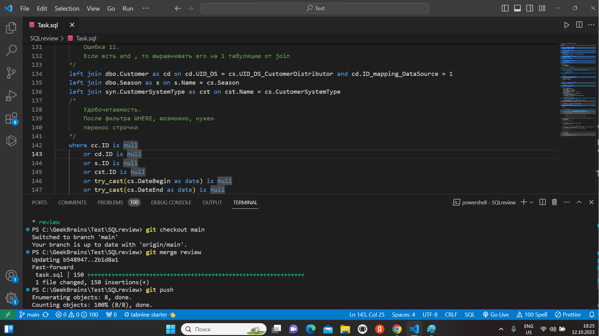

# Последовательность выполнения работы:

1. Создали пустой репозиторий
2. Создаем ветку, в которую и помещаем текст задания
3. Мерджим с веткой **main**, конфликта **не будет** (будет обновление информации в ветке **main**)

